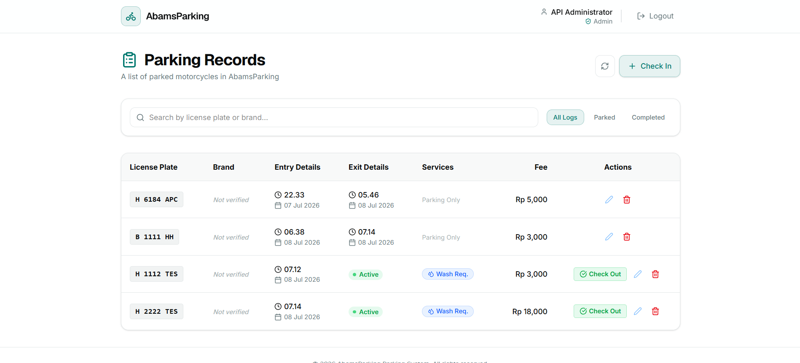
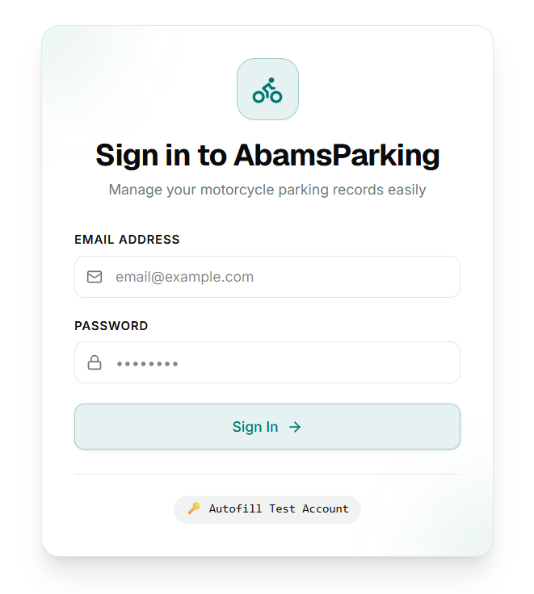
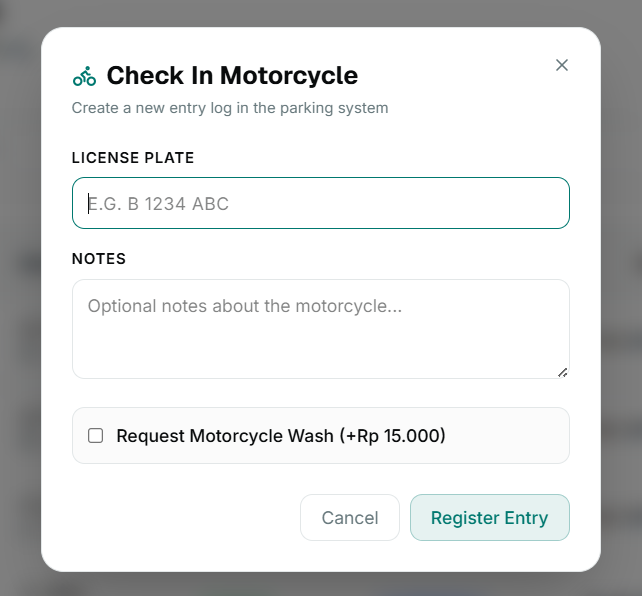
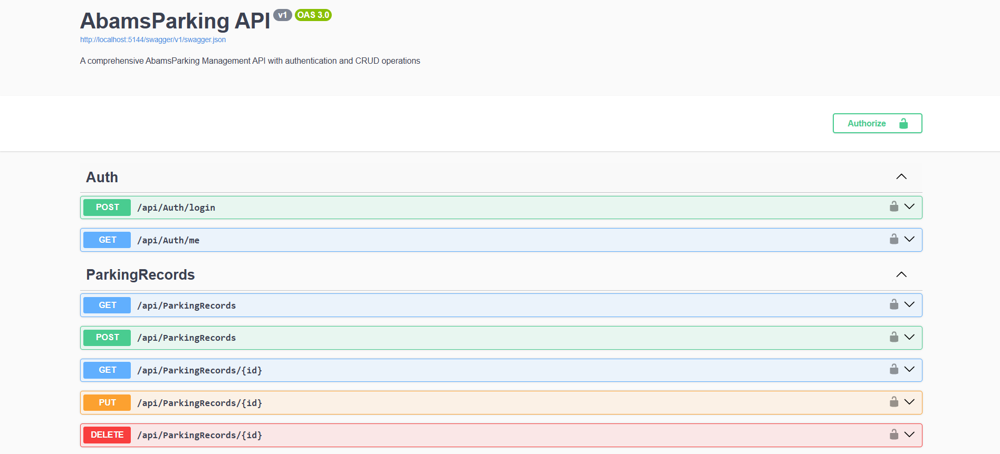

# Motorcycle Parking Service

Motorcycle Parking Service is a full-stack web application for managing motorcycle parking records, check-ins, and parking fees. It provides a simple interface for users to log parking activity, view records, and track parking status efficiently.

## Features

- User authentication and login flow
- Parking record creation and management
- Parking fee calculation
- Clean dashboard-style interface for viewing parking information

## App Screenshots

### Home Page

### Login Page

### Add Parking Record

### APIs

## Project Structure

- Backend: [MotorcycleParkingService](MotorcycleParkingService)
- Frontend: [frontend](frontend)

## Technology Stack

- Backend: ASP.NET Core
- Frontend: React + TypeScript + Vite
- Styling: Tailwind CSS
